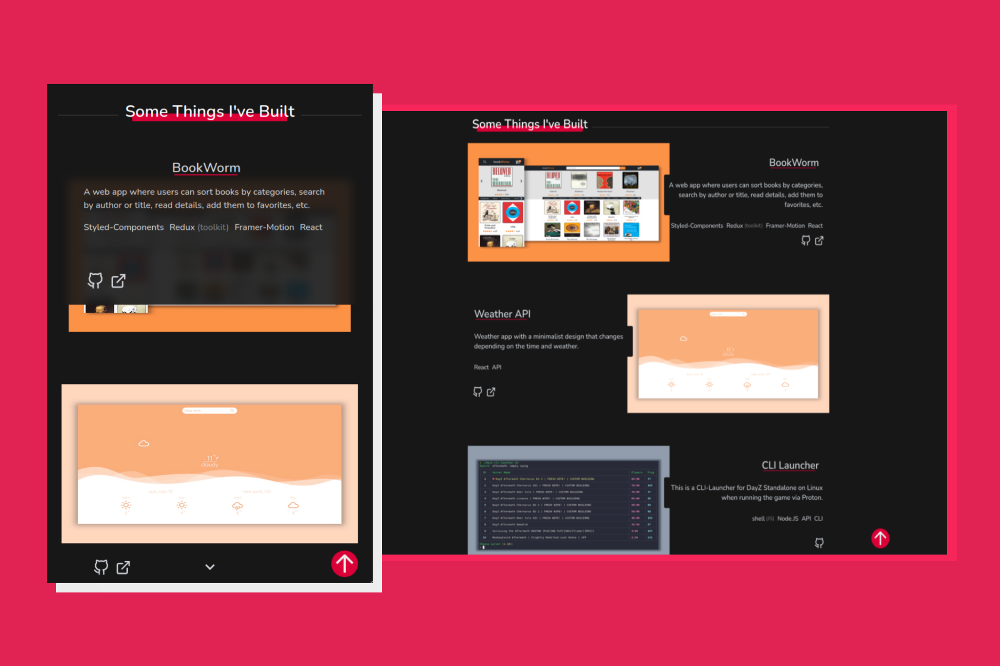

 

  

  <h1 align="center">Portfolio</h1>

  <h3 align="center">
    Built with <a href="https://nextjs.org/"><strong>Next.js</strong></a>
     
    <a href="https://portfolio-freakge.vercel.app/">View Demo</a>
  </h3>

## About The Project

### Build With

- [Next.js](https://nextjs.org/)
- [Framer-Motion](https://www.framer.com/motion/)
- [Styled-Components](https://styled-components.com/)
- [TailwindCSS](https://tailwindcss.com/)
- [Nodemailer](https://nodemailer.com/about/)
